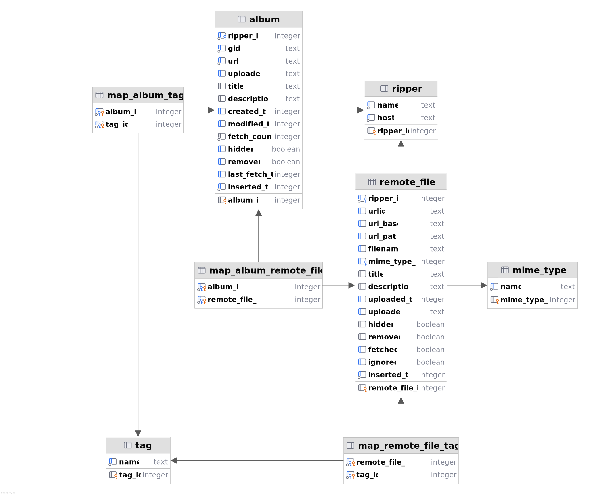
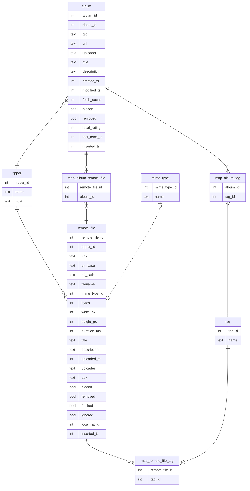

# Developing RipMe

## Concepts

* App: The entrypoint of the application. Creates a MainWindow if running with a GUI, or else rips from command line
* MainWindow: Creates the GUI, hooks up the GUI to the ripping logic.
* AbstractRipper: The Ripper base class, holding all common methods.
* AbstractHTMLRipper, AbstractJSONRipper, AbstractSingleFileRipper, VideoRipper
  * Specialized base classes that extend AbstractRipper. All rippers extend one of these.
* RipUrlId: **The RipMe unique identifier of a remote file** on a host, associated with a Ripper.
  * Using RipUrlId instead of a raw URL allows rippers to identify the same unique file which may be given time-limited or tokened URLs that may change over time.
* TokenedUrlGetter: When working with time-limited or tokened URLs, the DownloadFileThread needs to generate the URL on demand. Rippers create a TokenedUrlGetter for this.
* ClipboardUtils: Handles "Autorip from clipboard", polls the clipboard a few times per second for rippable URLs.
  * Warning: Java does not have a cross-platform way to cleanly watch the clipboard for change events. Trying to implement it in this app is a waste of time. FlavorListener only fires when the type of data in the clipboard changes (image, string, file), but if the type remains the same while the underlying data changes ("oldvalue", "newvalue"), no action is triggered. Using ClipboardOwner#lostOwnership can cause an infinite feedback loop if any other application attempts to monitor the clipboard using the same method.
* DownloadFileThread: Downloads the files. Sends events back up to the Ripper, which emits events with a RipStatusMessage back up to MainWindow.
* SQLite
  * DatabaseManager: Handles connections to the database.
  * Album and AlbumDao: A data class and a low-level Data Access Object for albums.
  * RemoteFile and RemoteFileDao: A data class and a low-level Data Access Object for metadata about files we might fetch.
  * RipService: The primary business logic layer to get Albums and RemoteFiles. Uses the DAOs.

## Config Files and Log Files
* rip.properties: The primary RipMe configuration file. Place next to the jar to enable portable mode. Contains the queued items, too.
* history.json: The configuration file that populates the History panel with HistoryEntry records; each ripped album gets an entry.
* ripme.downloaded.files.log: A plain text file of local paths to files that were downloaded.
* ripme.sqlite: The SQLite database that tracks history of downloaded files and albums, but not necessarily the local file destination.
  * Storing the local file destination may cause data in the database to become stale quickly if it is moved, and it takes up extra space. Separately storing ripme.downloaded.files.log is simpler.
  * While the database is open in RipMe or another application, ripme.sqlite-shm and ripme.sqlite-wal may be created. If RipMe is the only application using the database, the shm and wal files are cleaned up when ripme closes.
* ripme.log: The primary log file. Historically, during ripping, the log file was written to the album folder, but that broke after upgrading log4j (fixable).

### Logging

Use LogManager.getLogger() to create a static logger in each class. To prevent poor application performance from logging, use pattern strings instead of string concatenation.
* Good example: `logger.debug("Checking page {} of {}", currentPage, totalPages);`
* Bad example: `logger.debug("Checking page" + currentPage + " of " + totalPages);`

Any string shown in Log panel in the UI deserves to be localized in the UI, but it might make less sense to localize log messages shown in the terminal or log file.

### Localization

Use template strings with placeholders instead of string concatenation.
* Good example: `Utils.getLocalizedString("0.while.downloading.1", statusCode, url.toExternalForm())`
* Bad example: `statusCode + " " + Utils.getLocalizedString("while.downloading") + " " + url.toExternalForm()`

### SQLite Database

Schema migration is handled by Flyway.
Put schema upgrade scripts in `src/main/resources/db/migration`
and follow the naming pattern of `Vxxx__short_description.sql`, where xxx is an incremental zero-padded number.

Do not change the content of migration scripts after a version has been released,
or checksum differences will cause migrations from old schema versions to fail.
Migration scripts that have not been released may change during development.

`ripper.host` is populated by `getHost()`, which is not too clean, as some rippers create a different host based on URL.
In the future, I'd like to make `getHost()` static, and move the instance-based parts to `getGID()`, which whill be cleaner.

#### Diagrams

SVG diagram of the schema

Mermaid diagram of the schema

## Testing

The whole app's purpose is dependent on ephemeral third-party services. We ought to make some dummy service to test the core application's ripping without wasting bandwidth. TODO.

I'm ignoring the flaky tests for now, because I don't want to fix every ripper. Contributions welcome, complaints not welcome.
